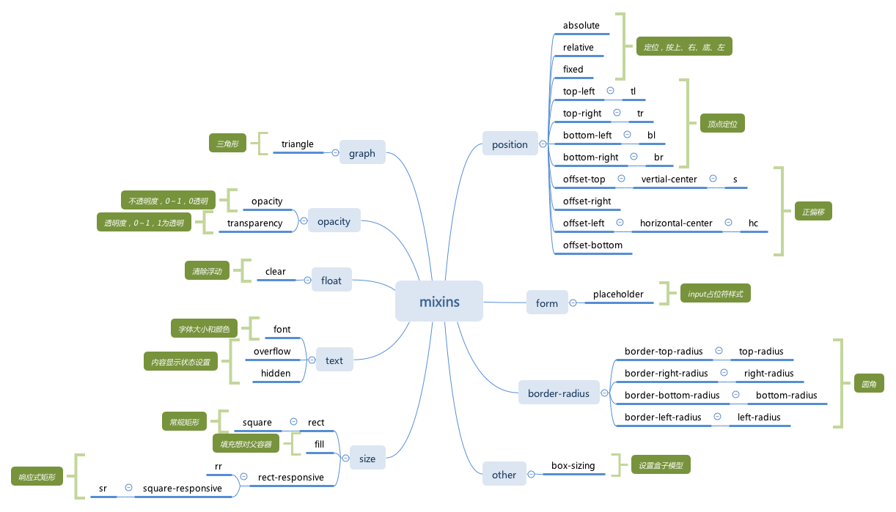
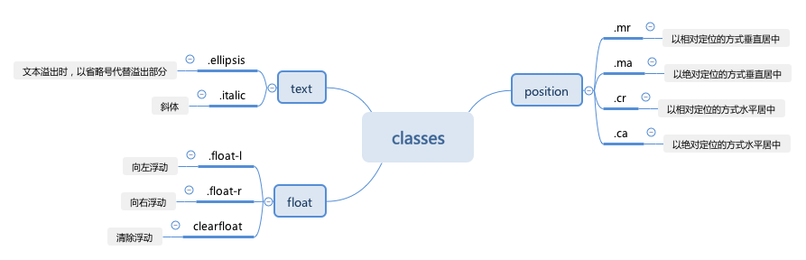

<p align="center">
  
</p>

sass中有用的、高效的mixin、class和组件

## 安装

```shell
$ npm install git+ssh://git@gitlab.genomics.cn:2200/DTCLab/Library/sasskit.git
```

## 测试

```shell
$ npm run test
```

## 依赖

- [`normalize.css`](http://necolas.github.io/normalize.css/) A modern, HTML5-ready alternative to CSS resets
- [`sass-lint`](https://github.com/sasstools/sass-lint) A Node-only Sass linter for both sass and scss syntax!


## 包含内容


### 文件组成

- `./class-mixins/`：特殊的class样式mixin函数集合
- `./mixins/`：高效的、实用的mixin函数集合
- `./class-mixins.scss`：./class-mixins/对外出口
- `./classes.scss`：通用的、常用的class样式
- `./mixins.scss`：./mixins/对外出口
- `./reset.scss`：重置并统一不
- `./variables.scss`： 变量定义


### mixin集合图



注：*需引入./mixins.scss文件*


### class集合图



注：*需引入./classes.scss文件*
